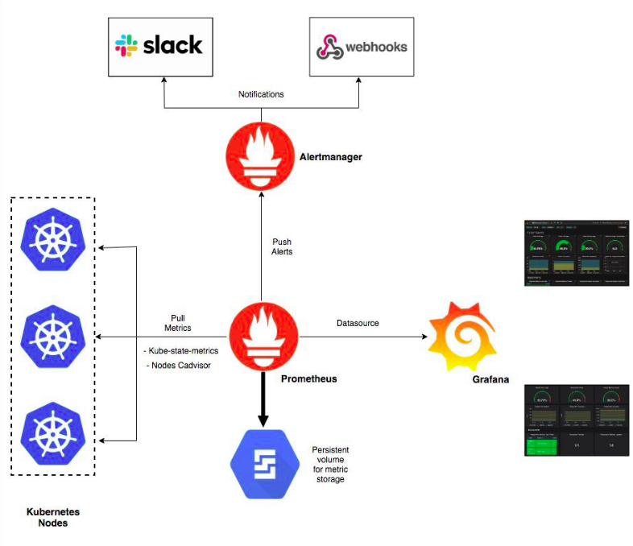

# prom-grafana

## This is how to deploy grafana and promethues helm charts

## Deploy Grafana 
```
cd grafana
kubectl create namespace monitoring
helm install --name release1 --namespace monitoring .
```


## Deploy prometheus 
```
cd prometheus
kubectl create namespace monitoring
helm install --name release2 --namespace monitoring .
```


- if you need to modify the retention period just modify the values.yaml file and modify the 
```
  prometheusSpec:
    retention: 35d
```
```
helm upgrade release2 .
```

## install Helm and Tiller

```
curl https://raw.githubusercontent.com/kubernetes/helm/master/scripts/get > install-helm.sh
chmod u+x install-helm.sh
./install-helm.sh

kubectl -n kube-system create serviceaccount tiller
kubectl create clusterrolebinding tiller --clusterrole cluster-admin --serviceaccount=kube-system:tiller
helm init --service-account tiller
```

## kubectl
```
kubectl get po -o wide
kubectl get nodes
kubectl get daemonsets.

kubectl port-forward svc/release-prometheus-operato-prometheus 9090:9090
```


# Docker Images
```
docker pull quay.io/coreos/prometheus-operator:v0.35.0
docker pull squareup/ghostunnel:v1.5.2
docker pull quay.io/coreos/prometheus-config-reloader:v0.35.0
docker pull quay.io/coreos/configmap-reload:v0.0.1
docker pull jettech/kube-webhook-certgen:v1.0.0
docker pull quay.io/coreos/kube-state-metrics:v1.9.3
docker pull quay.io/prometheus/prometheus:v2.15.2
docker pull quay.io/prometheus/alertmanager:v0.20.0
docker pull quay.io/prometheus/node-exporter:v0.18.1
docker pull grafana/grafana:6.5.2
docker pull kiwigrid/k8s-sidecar:0.1.20


docker tag quay.io/coreos/prometheus-operator:v0.35.0 261527745982.dkr.ecr.us-east-1.amazonaws.com/test:prometheus-operator
docker tag squareup/ghostunnel:v1.5.2 261527745982.dkr.ecr.us-east-1.amazonaws.com/test:ghostunnel
docker tag quay.io/coreos/prometheus-config-reloader:v0.35.0 261527745982.dkr.ecr.us-east-1.amazonaws.com/test:prometheus-config-reloader
docker tag quay.io/coreos/configmap-reload:v0.0.1 261527745982.dkr.ecr.us-east-1.amazonaws.com/test:configmap-reload
docker tag jettech/kube-webhook-certgen:v1.0.0 261527745982.dkr.ecr.us-east-1.amazonaws.com/test:kube-webhook-certgen
docker tag quay.io/coreos/kube-state-metrics:v1.9.3 261527745982.dkr.ecr.us-east-1.amazonaws.com/test:kube-state-metrics
docker tag quay.io/prometheus/prometheus:v2.15.2 261527745982.dkr.ecr.us-east-1.amazonaws.com/test:prometheus
docker tag quay.io/prometheus/alertmanager:v0.20.0 261527745982.dkr.ecr.us-east-1.amazonaws.com/test:alertmanager
docker tag quay.io/prometheus/node-exporter:v0.18.1 261527745982.dkr.ecr.us-east-1.amazonaws.com/test:node-exporter
docker tag grafana/grafana:6.5.2 804934839242.dkr.ecr.us-east-1.amazonaws.com/test:grafana
docker tag kiwigrid/k8s-sidecar:0.1.20 804934839242.dkr.ecr.us-east-1.amazonaws.com/test:k8s-sidecar


docker push 261527745982.dkr.ecr.us-east-1.amazonaws.com/test:prometheus-operator
docker push 261527745982.dkr.ecr.us-east-1.amazonaws.com/test:ghostunnel
docker push 261527745982.dkr.ecr.us-east-1.amazonaws.com/test:prometheus-config-reloader
docker push 261527745982.dkr.ecr.us-east-1.amazonaws.com/test:configmap-reload
docker push 261527745982.dkr.ecr.us-east-1.amazonaws.com/test:kube-webhook-certgen
docker push 261527745982.dkr.ecr.us-east-1.amazonaws.com/test:kube-state-metrics
docker push 261527745982.dkr.ecr.us-east-1.amazonaws.com/test:prometheus
docker push 261527745982.dkr.ecr.us-east-1.amazonaws.com/test:alertmanager
docker push 261527745982.dkr.ecr.us-east-1.amazonaws.com/test:node-exporter
docker push 804934839242.dkr.ecr.us-east-1.amazonaws.com/test:grafana
docker push 804934839242.dkr.ecr.us-east-1.amazonaws.com/test:k8s-sidecar

```
```
export AWS_ACCESS_KEY_ID=xxxxxxxxxxxxxxxxxxx
export AWS_SECRET_ACCESS_KEY=xxxxxxxxxxxxxxxxxxxxxxxxxx
export AWS_REGION=us-east-1

$(aws ecr get-login --no-include-email --region us-east-1)

helm delete --purge release1
helm delete --purge release2

kubectl delete crd alertmanagers.monitoring.coreos.com eniconfigs.crd.k8s.amazonaws.com podmonitors.monitoring.coreos.com prometheuses.monitoring.coreos.com servicemonitors.monitoring.coreos.com prometheusrules.monitoring.coreos.com

```


# Architecture Design



- Components included in this helm Charts:

  - The Prometheus Operator
  - Highly available Prometheus
  - Highly available Alertmanager
  - Prometheus node-exporter
  - kube-state-metrics
  - Grafana


## Access the dashboards

- Promethues
```
$ kubectl --namespace monitoring port-forward svc/prometheus-k8s 9090
Then access via http://localhost:9090
```


- Grafana
```
$ kubectl --namespace monitoring port-forward svc/grafana 3000
Then access via http://localhost:3000
```


## Prometheus Advantages
- Kubernetes integration—supports service discovery and monitoring of dynamically scheduled services.  
- Built-in Alertmanager—sends out notifications via a number of methods based on rules that you specify.
- Pull based metrics—a pull-based monitoring system means that your services don’t have to know where your monitoring system is located. You can simply expose your metric as a HTTP endpoint and Prometheus pulls the metrics from it.


## Prometheus Backup
- There is 2 ways to backup the Prometheus data
  - Using kubernetes to create snapshot from your pvc(persitent volume claim)
  ```
  cd prometheus-backup
  kubectl create -f ./VolumeSnapshots.yaml
  ```
     this way has its limitation to only new version of k8s (1.17)


  - Another way is to use aws
  ```
  kubectl get pv
  kubectl get pv pvc-e51804ec-4fd2-11ea-be6b-0aacc1518097 -o yaml
  aws ec2 create-snapshot --volume-id vol-096f911f96d39b932 --description "This is volume snapshot"
  ```


